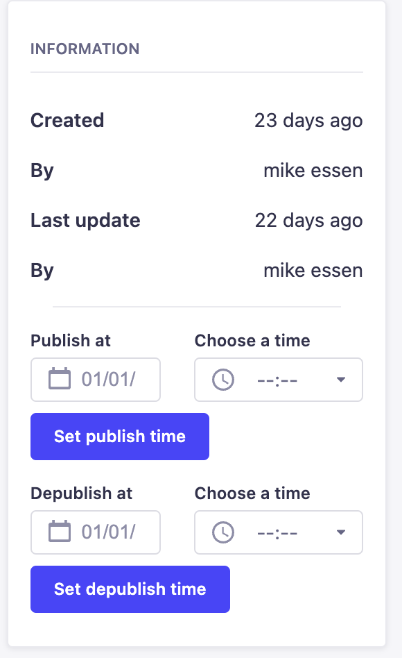

# Strapi plugin scheduler

This plugin allows you to publish and depublish collection types in the future. 
There are a couple of steps necessary to get the plugin up and running but they will be explained down below.

# Installation

1. To install the plugin run `npm i @webbio/strapi-plugin-scheduler` or `yarn add @webbio/strapi-plugin-scheduler`.

2. After the plugin is installed, add the plugin to the plugin.js file in your config folder.

```
scheduler: {
    enabled: true,
    config: {
      model: "scheduler",
    },
  },
```

3.  Add the cron task to the server.js file in your config folder.

```
const cronTasks = require("@webbio/strapi-plugin-scheduler/cron-task");

module.exports = ({ env }) => ({
  host: env('HOST', '0.0.0.0'),
  port: env.int('PORT', 1337),
  cron: {
    enabled: true,
    tasks: cronTasks,
  },
});
```


Now when you run your application, you will see some information is added to the sidebar. You can choose a date and time to publish or depublish your article.




**Future plans**
- TBA
